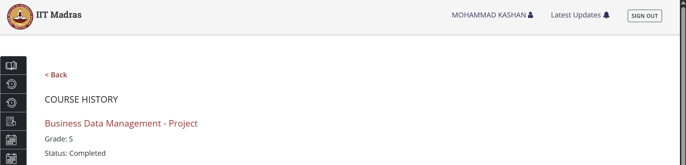
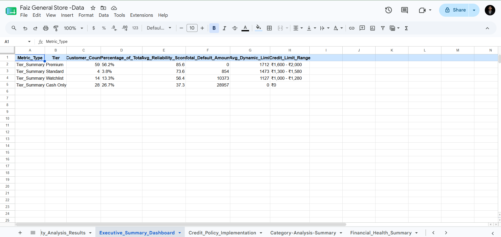

# 📈 Retail Profitability & Credit Risk Analytics

### IIT Madras Business Data Management (BDM) Capstone Project | Python | Business Analytics | Data-Driven Decision Making

⭐ **Achieved S Grade (90/100) in IIT Madras Business Data Management Capstone Project**

📊 Analyzed **2,625 credit transactions**, **1,105 category-wise sales records**, and **366 daily financial observations** to design a data-driven framework for improving profitability, cash flow quality, and credit risk management in a real retail business.

---

# 🏆 Academic Outcome

This project was completed as part of the **Business Data Management (BDM) Capstone Project** under the **BS in Data Science and Applications Program** at **Indian Institute of Technology Madras (IIT Madras)**.

**Final Grade: S (90/100)**



---

# 📌 Executive Summary

Faiz General Store, a family-owned grocery retailer in Prayagraj, generated approximately ₹30 lakh annual revenue but faced increasing financial pressure due to customer credit defaults, declining cash flow quality, and heavy dependence on low-margin product categories.

This project applied business analytics techniques to identify the root causes of these issues, quantify their financial impact, and design practical business solutions. The analysis combined financial performance evaluation, category profitability analysis, customer risk assessment, and credit policy redesign to improve decision-making.

The outcome was a structured framework capable of reducing default exposure, improving liquidity, and increasing overall profitability.

## Key Results

| Metric                       | Value       |
| ---------------------------- | ----------- |
| Annual Revenue Analyzed      | ₹32.8 Lakhs |
| Customers Evaluated          | 105         |
| Credit Transactions Analyzed | 2,625       |
| Category-wise Sales Records  | 1,105       |
| Daily Financial Records      | 366         |
| Bad Debt Identified          | ₹40,184     |
| Potential Additional Profit  | ₹53,798+    |
| Projected Profit Growth      | +43.4%      |
| Academic Grade               | S (90/100)  |

---

# 📊 Executive Dashboard

The project culminated in an executive-level dashboard summarizing customer risk, financial performance, profitability metrics, and business recommendations.



---

# 🏢 Business Context

## Organization

**Faiz General Store**

* Family-owned grocery retailer
* Operating since 1995
* B2C retail business
* Serves daily household and consumer goods
* Approximate annual revenue of ₹30 lakh

Although revenue remained relatively stable, the business lacked structured systems for customer credit assessment, risk management, and profitability optimization.

---

# 🚨 Business Problems

The analysis identified three major challenges affecting business performance.

## 1. Credit Risk

* Increasing losses from customer defaults
* No formal customer credit evaluation system
* Credit allocation based primarily on experience and intuition

## 2. Cash Flow Deterioration

* Declining Cash-to-Credit Ratio
* Rising working capital pressure
* Reduced liquidity quality

## 3. Profitability Challenges

* Revenue concentrated in low-margin categories
* High-margin categories underutilized
* Inefficient product portfolio mix

---

# 🔒 Confidentiality Notice

This project was conducted using real business records from Faiz General Store.

To protect customer privacy and business-sensitive information, raw customer-level datasets, personally identifiable information (PII), and operational transaction records are not included in this public repository.

Only aggregated analytical outputs, dashboards, visualizations, methodologies, and business insights are shared.

---

# 🗂️ Data Overview

The analysis was performed on manually digitized operational records collected from store transactions.

## Dataset Summary

| Dataset                      | Period              | Records    |
| ---------------------------- | ------------------- | ---------- |
| Daily Financial Performance  | Sep 2024 – Aug 2025 | 366 Rows   |
| Category-wise Sales Analysis | Mar 2025 – Aug 2025 | 1,105 Rows |
| Credit Transactions          | Mar 2025 – Aug 2025 | 2,625 Rows |

## Data Included

* Revenue
* Cash Sales
* Credit Sales
* Product Categories
* Customer Credit History
* Outstanding Balances
* Payment Delays
* Default Behaviour

---

# 🔍 Methodology

The project followed a complete business analytics workflow.

```text
Business Understanding
        ↓
Data Collection
        ↓
Data Digitization
        ↓
Data Cleaning
        ↓
Data Validation
        ↓
Exploratory Data Analysis
        ↓
Risk Modeling
        ↓
Business Recommendations
        ↓
Impact Projection
```

---

# 📉 Cash Flow Analysis

Financial health analysis revealed a continuous decline in the Cash-to-Credit Ratio, indicating worsening liquidity quality and increasing exposure to credit-related risks.


### Key Insight

Cash-to-Credit Ratio declined from:

**3.42 → 1.86**

placing the business in a financial warning zone.

---

# 🛒 Category Profitability Analysis

Revenue analysis showed that Staples contributed the largest share of sales but delivered relatively low profit margins. Higher-margin categories such as Personal Care and Snacks represented attractive growth opportunities.


### Key Insight

| Category      | Revenue Share | Profit Margin |
| ------------- | ------------- | ------------- |
| Staples       | 57.4%         | 9.25%         |
| Personal Care | 3.7%          | 26.56%        |
| Snacks        | 5.0%          | 20.91%        |

---

# 🤖 Customer Risk Modeling

To improve credit allocation decisions, a custom **Reliability Score (0–100)** was developed.

## Model Structure

Reliability Score =

* Default Behaviour Score (70%)
* Payment Delay Score (30%)

## Customer Segmentation

| Tier      | Score Range |
| --------- | ----------- |
| Premium   | 80+         |
| Standard  | 65–79       |
| Watchlist | 50–64       |
| Cash Only | <50         |

This segmentation framework enabled risk-based customer classification and structured credit decision-making.

---

# 📊 Customer Risk Insights

Analysis revealed that financial losses were highly concentrated among a small segment of customers.

### Major Findings

* 98% of financial losses originated from Watchlist and Cash Only customers
* Cash Only customers generated the majority of bad debt
* Credit risk was concentrated among a relatively small group of customers


---

# 💳 Dynamic Credit Policy Framework

The project introduced a risk-based credit allocation system designed to align credit limits with customer reliability.

## Credit Limit Formula

```text
Credit Limit = Reliability Score × 20
```

## Business Benefits

* Reduced default exposure
* Improved credit discipline
* Better working capital allocation
* Scalable credit management framework


---

# 💰 Projected Business Impact

Implementation of the proposed recommendations demonstrated substantial potential for improving profitability and reducing financial losses.

| Metric        | Current   | Projected |
| ------------- | --------- | --------- |
| Net Profit    | ₹1,23,804 | ₹1,77,602 |
| Net Margin    | 9.45%     | 13.50%    |
| Profit Growth | —         | +43.4%    |

## Estimated Additional Profit

### ₹53,798+

---

# 🛠 Skills Demonstrated

## Data Management

* Data Collection
* Data Digitization
* Data Validation
* Data Standardization
* Data Quality Assessment

## Data Preparation

* Data Cleaning
* Missing Value Handling
* Feature Engineering
* Data Aggregation
* Customer-Level Dataset Creation

## Business Analytics

* KPI Analysis
* Profitability Analysis
* Cash Flow Analysis
* Customer Segmentation
* Business Performance Evaluation

## Data Analysis

* Exploratory Data Analysis (EDA)
* Trend Analysis
* Financial Analysis
* Category Performance Analysis
* Descriptive Analytics

## Risk Analytics

* Credit Risk Assessment
* Reliability Scoring
* Customer Classification
* Risk-Based Credit Allocation

## Business Intelligence

* Dashboard Development
* Executive Reporting
* Data Visualization
* Strategic Recommendation Design

## Tools & Technologies

* Python
* Pandas
* NumPy
* Matplotlib
* Seaborn
* Google Colab
* Google Sheets
* Git
* GitHub

---

# 📂 Repository Structure

```text
bdm-capstone-retail-business-analytics/
│
├── reports/
│   ├── Proposal_Report.pdf
│   ├── Midterm_Report.pdf
│   └── Final_Report.pdf
│
├── notebook/
│   └── BDM_Project_Notebook.ipynb
│
├── presentations/
│   ├── Academic_Presentation.pptx
│   └── Stakeholder_Presentation.pptx
│
├── images/
│   ├── iitm_bdm_project_s_grade.png
│   ├── executive_dashboard.png
│   ├── cash_to_credit_ratio_trend.png
│   ├── bcg_matrix.png
│   ├── reliability_tier_default_impact.png
│   └── dynamic_credit_limit_system.png
│
└── README.md
```

---

# 🎯 Learning Outcomes

Through this project, I gained practical experience in:

* Solving real-world business problems using data
* Converting raw business records into analytical datasets
* Designing risk-based decision frameworks
* Translating analytical insights into business recommendations
* Communicating findings to technical and non-technical stakeholders
* Applying business analytics in a real operational environment

---

# 👨‍💻 Author

**Mohammad Kashan**

BS in Data Science and Applications
Indian Institute of Technology Madras

GitHub: https://github.com/mkashan-tech

LinkedIn: https://linkedin.com/in/mohammad-kashan-tech

---

⭐ If you found this project interesting, feel free to explore the reports, notebook, visualizations, dashboards, and presentations included in this repository.
